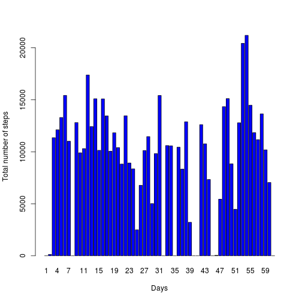
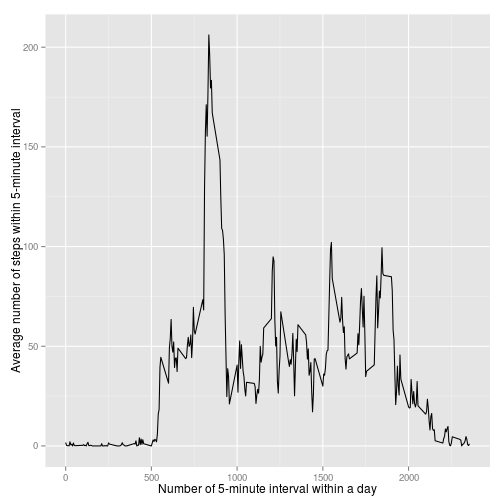
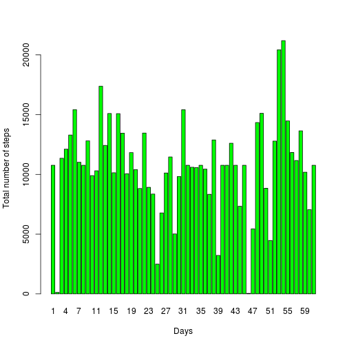
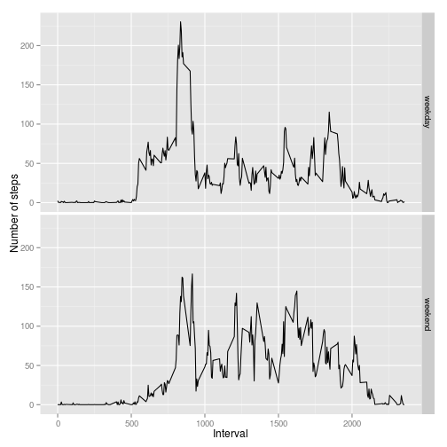

# Reproducible Research
# Peer Assessment 1

This document represents solution for assignment #1 within a course Reproducible Research at Coursera.

## Loading and preprocessing the data

First of all we need unpack and read the data with the following code


```r
unzip(zipfile="activity.zip")
data <- read.csv("activity.csv")
```

## What is mean total number of steps taken per day?

To find the answer we need to summaraze steps for each day and than calculate the mean:


```r
numOfSteps <- tapply(data$steps, data$date, FUN=sum, na.rm=TRUE)
mean(numOfSteps, na.rm=TRUE)
```

```
## [1] 9354.23
```

Also we can calculate median:

```r
median(numOfSteps, na.rm=TRUE)
```

```
## [1] 10395
```

And plot  histogram of the total number of steps taken each day as follows:

```r
barplot(numOfSteps, names.arg = 1:length(numOfSteps), xlab = "Days", ylab="Total number of steps", col=c("blue"))
```

 

## What is the average daily activity pattern?

Here we will plot with ggplot to see the average values for each time interval, as follows:


```r
library(ggplot2)
averageStepsNumber <- aggregate(x=list(steps=data$steps), by=list(interval=data$interval),
                      FUN=mean, na.rm=TRUE)
ggplot(data=averageStepsNumber, aes(x=interval, y=steps)) +
    xlab("Number of 5-minute interval within a day") +
    ylab("Average number of steps within 5-minute interval") +
    geom_line()
```

 

5-minute interval across all the days that contains the maximum number of steps can be found as:


```r
averageStepsNumber[which.max(averageStepsNumber$steps),]
```

```
##     interval    steps
## 104      835 206.1698
```

## Imputing missing values

The total number of missing values in the dataset can be determines as follows:


```r
missing <- which(is.na(data$steps))
length(missing)
```

```
## [1] 2304
```

The followin code replaces missing values with the mean values:

```r
#copy all data
updatedData <- data
#for all rows with missing steps
for (i in 1:length(missing))
{
    # find the 5-minute interval for which data is missing (missing[i] is a index of row with missing value)
    interval <- data$interval[missing[i]]
    # in averageStepsNumber find a row for determined 5-minute interval 
    averageintervalindex <- which(averageStepsNumber$interval == interval)
    # get value from averageintervalindex, round it and save instead if NA
    updatedData$steps[missing[i]] <- round(averageStepsNumber$steps[averageintervalindex])
}
```

And now mean and median values are:

```r
updatedSteps <- tapply(updatedData$steps, updatedData$date, FUN=sum, na.rm=TRUE)
mean(updatedSteps)
```

```
## [1] 10765.64
```

```r
median(updatedSteps)
```

```
## [1] 10762
```

And new historgam for new data is follows:

```r
barplot(updatedSteps, names.arg = 1:length(updatedSteps), xlab = "Days", ylab="Total number of steps", col=c("green"))
```

 

## Are there differences in activity patterns between weekdays and weekends?

First of all locale settings for time must be specified (in order to work with standard English names of days):

```r
Sys.setlocale("LC_TIME", "C")
```

```
## [1] "C"
```

Then factor variable have to be created:

```r
daysOfWeek <- weekdays(as.Date(updatedData$date))
weekendindex <- c(which(daysOfWeek %in% "Sunday"),which(daysOfWeek %in% "Saturday"))
updatedData$weekstatus <- factor(rep("weekday",length(daysOfWeek)), 
                                 levels = c("weekday","weekend"),
                                 ordered = T)
updatedData$weekstatus[weekendindex] <- "weekend"
```

And now plot can be made:

```r
averages <- aggregate(steps ~ interval + weekstatus, data=updatedData, mean)
ggplot(averages, aes(interval, steps)) + facet_grid(weekstatus ~ .) +
       geom_line() + xlab("Interval") + ylab("Number of steps")
```

 
